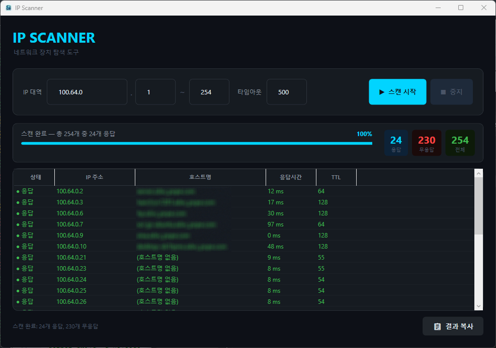

# IP Scanner

C# WPF 기반의 네트워크 IP 스캐너입니다. IP 대역을 입력하면 실제 핑을 날려 응답 여부와 호스트명을 확인할 수 있습니다.

## 기능

- IP 대역 범위 설정 (예: 192.168.1.1 ~ 192.168.1.254)
- ICMP 핑으로 실시간 응답 확인
- 호스트명(기기 이름) 자동 조회
- 응답 IP 오름차순 정렬
- 응답시간 및 TTL 표시
- 결과 클립보드 복사

## 요구사항

- Windows 10 이상
- .NET 10 Runtime

## 사용법

1. IP 대역 입력 (예: `192.168.1`, 범위 `1 ~ 254`)
2. 타임아웃 설정 (기본값: 500ms)
3. **스캔 시작** 클릭
4. 스캔 중 **중지** 버튼으로 중단 가능

## 라이선스

[MIT](LICENSE)